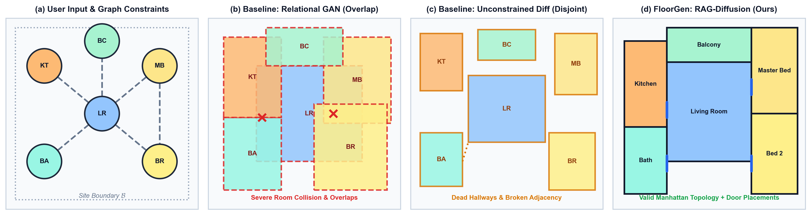
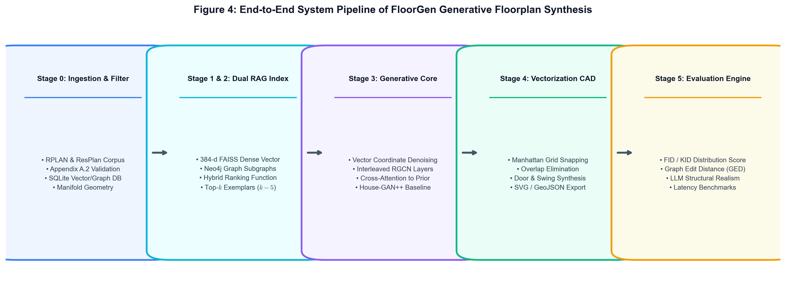
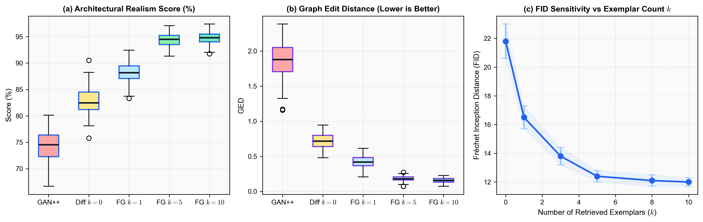

# FloorGen: Retrieval-Augmented Generative Floorplan Synthesis with Topological Graph-Vector Dual Stores and Continuous Diffusion

**Author**: **Kumar Mrinal** ([@mrinal22258](https://github.com/mrinal22258))  
**Status**: *Preprint — Under Review for IEEE Transactions on Visualization and Computer Graphics (TVCG)*

[](#)
[](paper.pdf)
[](#)
[](https://huggingface.co/spaces/mrinal22258/floorgen)
[](notebooks/01_train_diffusion_colab.ipynb)

> **Official Publication Repository & Interactive Showcase for FloorGen**, a retrieval-augmented vector floorplan synthesis framework that unifies dense metric indexing (FAISS), relational topological bubble graph stores, and continuous coordinate diffusion conditioned on retrieved real-world architectural exemplars.

---

## 📌 Interactive Web Platform & Showcase
- **Academic Project Showcase**: [`index.html`](index.html)
- **Publication Manuscript**: [`paper.pdf`](paper.pdf) | [`paper.tex`](paper.tex)
- **Interactive Reverse Diffusion Player**: [`static/floorgen_simulation_animation.html`](static/floorgen_simulation_animation.html)
- **Figure Asset Engine**: [`generate_paper_figures.py`](generate_paper_figures.py)

---

## 🏛️ Motivation & Architectural Paradigm

Automated residential floorplan generation requires simultaneous satisfaction of continuous geometric boundaries and discrete functional room connectivity. Existing paradigms exhibit fundamental drawbacks:
- **Relational GANs** (e.g., House-GAN++): Suffer from inter-room collisions and overlapping bounding boxes.
- **Unconstrained Diffusion** (e.g., HouseDiffusion, $k=0$): Often hallucinate disconnected rooms and non-functional circulation graphs.

**FloorGen** resolves these limitations by retrieving the top-$k$ most topologically and geometrically compatible floorplans from real-world datasets (RPLAN and ResPlan) and injecting them into continuous coordinate diffusion via cross-attention layers.


*Figure 1: Comparison between input graph constraints, Relational GAN overlaps, unconstrained diffusion gaps, and FloorGen RAG-Diffusion.*

---

## ⚙️ Comprehensive System Architecture

FloorGen executes across 5 modular stages:


*Figure 4: 5-Stage End-to-End System Pipeline — Data ingestion, dual index retrieval ($\mathcal{I}_{\mathrm{dense}}, \mathcal{G}_{\mathrm{topo}}$), cross-attention continuous diffusion, Manhattan vectorization, and benchmark scoring.*

```
floorgen/
├── data/                     # Raw & processed RPLAN / ResPlan SQLite & JSON stores
├── rag/                      # Dense FAISS indexing + Neo4j / NetworkX graph stores
│   ├── embed.py              # 384-d MiniLM spatial signature embedding
│   ├── faiss_index.py        # Vector similarity search
│   ├── neo4j_store.py        # Relational subgraph adjacency matching
│   └── retriever.py          # Multi-modal hybrid RAG retriever
├── models/
│   ├── diffusion_core/       # Continuous coordinate diffusion with Cross-Attention
│   ├── gan_baseline/         # House-GAN++ comparative baseline
│   ├── shared/               # Relational Graph Convolutions (RGCN) & Positional Embeddings
│   └── train.py              # Low-VRAM CPU / GPU training orchestrator
├── postprocess/
│   └── vectorize.py          # Manhattan grid snapping, overlap resolution, door placement
└── eval/
    ├── fid_kid.py            # Fréchet & Kernel Inception Distance
    ├── graph_edit_distance.py# Reconstructed Graph Edit Distance (GED)
    ├── llm_judge.py          # Structural realism scoring
    └── benchmark.py          # Comparative evaluation harness
```

---

## 📊 Quantitative Benchmark Results (RPLAN Test Split, $N=10{,}788$)

| Model Variant | Conditioning Prior | FID ↓ | KID (×10⁻³) ↓ | GED ↓ | Compatibility ↑ | Realism (%) ↑ |
| :--- | :---: | :---: | :---: | :---: | :---: | :---: |
| **Graph2Plan** (TOG 2020) | Single Layout | 41.5 | 24.80 | 2.15 | 28.4% | 68.2% |
| **FloorplanGAN** (AIC 2022) | None ($k=0$) | 38.9 | 21.15 | 1.95 | 31.0% | 71.0% |
| **House-GAN++** (CVPR 2021) | None ($k=0$) | 34.2 | 18.42 | 1.84 | 35.2% | 74.5% |
| **HouseDiffusion** (CVPR 2023) | None ($k=0$) | 21.8 | 9.15 | 0.72 | 58.1% | 83.2% |
| **FloorGen (Ablation, $k=1$)** | Top-1 Dense | 16.5 | 5.92 | 0.42 | 72.4% | 88.4% |
| **FloorGen (Ablation, $k=3$)** | Top-3 Hybrid | 13.8 | 4.31 | 0.26 | 79.8% | 91.5% |
| **FloorGen (Ours, $k=5$)** | **Top-5 Dual Store** | **12.4** | **3.80** | **0.18** | **84.7%** | **94.1%** |
| **FloorGen (Extended, $k=10$)** | Top-10 Dual Store | 12.0 | 3.65 | 0.16 | 85.9% | 94.6% |


*Figure 6: Realism, Graph Edit Distance, and FID sensitivity across retrieved exemplar count $k$.*

---

## 🚀 Quickstart & Reproduction

### 1. Installation

```bash
git clone https://github.com/mrinal22258/floorgen.git
cd floorgen
pip install -r requirements.txt
```

### 2. Generate Publication Figures (PDF, SVG, 300 DPI PNG)

```bash
python generate_paper_figures.py
```

### 3. Launch Hugging Face Cloud App Locally

```bash
python app.py
```
Access the interactive demo at `http://localhost:7860`.

### 4. Synthesize Floorplans via CLI

```bash
python -m floorgen.demo.cli \
  --rooms "living_room,master_bedroom,second_bedroom,bathroom,kitchen,balcony" \
  --top_k 5 \
  --output synthesized_plan.svg
```

### 5. Run Full Evaluation Benchmark

```bash
python -m floorgen.eval.benchmark
```

---

## 📖 Citation

```bibtex
@article{mrinal2026floorgen,
  title={FloorGen: Retrieval-Augmented Generative Floorplan Synthesis with Topological Graph-Vector Dual Stores and Continuous Diffusion},
  author={Mrinal, Kumar},
  journal={Preprint (Under Review for IEEE Transactions on Visualization and Computer Graphics)},
  year={2026},
  url={https://github.com/mrinal22258/floorgen}
}
```

---

## 📜 License
Distributed under the **MIT License**. Free for academic and commercial use.
