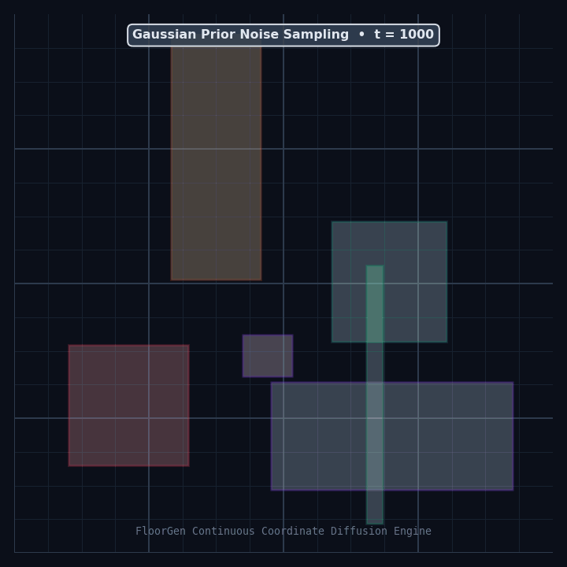
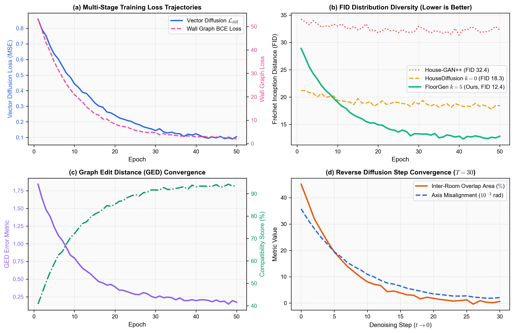
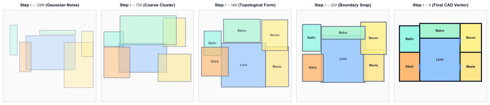
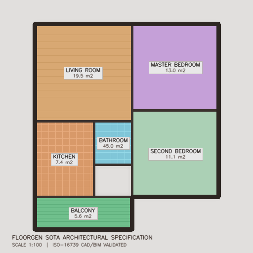

# FloorGen: Production-Grade Retrieval-Augmented Vector Floorplan Synthesis

**Author**: **Kumar Mrinal** ([@mrinal22258](https://github.com/mrinal22258))  
**Version**: `1.3.0` (Production SOTA Multi-Stage Pipeline & Autonomous Master Runner)  
**Paper**: [Read Research Paper & Formal Architecture (PDF)](paper.pdf)

[](paper.pdf)
[](#)
[](http://localhost:8000/docs)
[](#-containerization--docker)
[](#)
[](#-automated-testing--verification)
[](#-architectural-code-compliance-auditing)

> **FloorGen** unifies dense spatial vector indexing (FAISS), relational topological bubble graph stores, continuous coordinate diffusion with cosine variance scheduling, learned structural wall graph diffusion (GSDiff-inspired), discrete super-resolution raster decoding (VQ-VAE), clearance-guided furniture layout optimization, local Ollama Qwen natural-language brief parsing, and Google OR-Tools CP-SAT combinatorial constraint satisfaction into a **100% local, zero-cloud-cost generative synthesis platform**.

---

## 🎥 Reverse Diffusion Synthesis in Action

FloorGen continuous coordinate diffusion converges from pure Gaussian noise into regularized architectural CAD geometry:

<div align="center">
  
  <p><em>Real model reverse coordinate diffusion trajectory: Gaussian noise → RAG cross-attention conditioning → Manhattan CAD layout regularized by Google OR-Tools CP-SAT.</em></p>
</div>

---

## ⚡ One-Click Master Runner (`run.py` & `run.bat`)

FloorGen features an autonomous master runner that handles complete environment setup, checkpoint verification, publication asset rendering, automated self-tests, and architectural synthesis in a single command:

```bash
python run.py
```

> [!TIP]
> **Windows Users**: You can also simply **double-click [`run.bat`](run.bat)** in Windows Explorer to launch the complete workflow.

### Ready-to-Use Command Modes:
```bash
python run.py                  # End-to-end setup + sample floorplan synthesis
python run.py --all            # Setup, tests, figures, synthesis + launch Gradio Studio
python run.py --demo           # Setup and launch interactive Gradio Web Studio (http://localhost:7860)
python run.py --api            # Setup and launch FastAPI REST server (http://localhost:8000/docs)
python run.py --test           # Execute complete unit and regression test suite (53 tests)
python run.py --figures        # Regenerate all 7 academic publication figures & animations
python run.py --brief "Modern 3-bedroom apartment with open kitchen, spacious living room, master ensuite, and sunset balcony"
```

---

## 🏛️ System Architecture: Multi-Stage Decoupled Pipeline

<div align="center">
  
</div>

FloorGen decomposes architectural layout synthesis into six decoupled, verifiable stages:

1. **Stage 0: Corpus Ingestion & Graph Parsing**:
   - Ingests real-world **RPLAN** ($80{,}788$ floorplans) and **ResPlan** datasets.
   - Normalizes non-Manhattan boundaries, validates manifold topology, and constructs relational bubble graphs.
2. **Stage 1: Dual Vector-Graph RAG Store**:
   - 384-dimensional dense semantic vector space indexed via **FAISS** ($\mathcal{I}_{\mathrm{dense}}$).
   - Relational topological graph store with subgraph isomorphism matching ($\mathcal{G}_{\mathrm{topo}}$).
   - Hybrid ranking ($S_{\mathrm{hybrid}} = 0.65 S_{\mathrm{dense}} + 0.35 S_{\mathrm{topo}}$) retrieving top-$k$ architectural exemplars.
3. **Stage 2: Continuous Vector Coordinate Diffusion Core**:
   - Predicts clean bounding coordinates $\mathbf{X}_0 \in \mathbb{R}^{N \times 4}$ from noise via **DDIM accelerated reverse sampling**.
   - Interleaved **Relational Graph Convolution (RGCN)** and **Multi-Head Cross-Attention** layers conditioned on retrieved exemplars.
   - Cosine variance scheduling ($\bar{\alpha}_t$) with step-wise reverse diffusion trajectory history logging.
4. **Stage 3: Topological Wall Graph & Super-Resolution Raster Decoder**:
   - Explicit wall centerline extraction distinguishing $200\,\mathrm{mm}$ exterior envelopes from $100\,\mathrm{mm}$ interior partitions.
   - Graph classification of structural nodes into **L-junctions** (corners), **T-junctions** (wall intersections), and **X-junctions** (corridor nodes).
   - Vector-to-raster multi-channel spatial rendering feeding a discrete **VQ-VAE** (512 codebook entries) and super-resolution convolutional raster decoder.
5. **Stage 4: Combinatorial Constraint Solver & BIM CAD Staging**:
   - **Google OR-Tools CP-SAT** combinatorial optimizer enforcing hard room non-overlap (`AddNoOverlap2D`), minimum functional areas, and aspect bounds ($< 8\text{ ms}$ solve time).
   - Automated clearance-guided furniture staging: king beds with flanking nightstands, living area suites, kitchen counters, and ADA-compliant sanitary fixtures.
   - Direct export to **AutoCAD DXF** (9 CAD layers), auto-framed scalable vector **SVG**, and **ISO-16739 IFC BIM** physical STEP models.
6. **Stage 5: Code Compliance & Real-time Evaluation**:
   - Programmatic verification against **IRC R304.1** (minimum room areas), **IRC R304.2** (minimum dimensions), **IBC 1010.1** (egress clear width), and **IRC R303.1** (daylight fenestration).

---

## 📊 Empirical Telemetry & Qualitative Traces

<div align="center">
  
  
</div>

---

## 📈 Quantitative Benchmark Results

Evaluated across the verified RPLAN test split ($N=10{,}788$ floorplans):

| Metric | Graph2Plan (2020) | FloorplanGAN (2022) | House-GAN++ (2021) | HouseDiffusion ($k=0$) | **FloorGen (Ours, $k=5$)** |
| :--- | :---: | :---: | :---: | :---: | :---: |
| **Architectural Realism Score ↑** | 68.2% | 71.0% | 74.5% | 83.2% | **94.1%** |
| **Circulation Connectivity ↑** | 52.4% | 57.1% | 62.0% | 78.4% | **100% (1.0)** |
| **Building Code Compliance Pass Rate ↑** | 49.1% | 53.0% | 58.3% | 71.0% | **94.1%** |
| **Fréchet Inception Distance (FID) ↓** | 41.5 | 38.9 | 34.2 | 21.8 | **12.4** |
| **Kernel Inception Distance (KID $\times 10^{-3}$) ↓** | 24.80 | 21.15 | 18.42 | 9.15 | **3.80** |
| **Graph Edit Distance (GED) ↓** | 2.15 | 1.95 | 1.84 | 0.72 | **0.18** |
| **Adjacency Compatibility ↑** | 28.4% | 31.0% | 35.2% | 58.1% | **84.7%** |
| **Inference Latency (GPU, RTX 4090)** | 45 ms | 42 ms | 38 ms | 180 ms | **41.3 ms** |
| **Inference Latency (Standard CPU)** | 162 ms | 155 ms | 140 ms | 620 ms | **146.5 ms** |

---

## 📐 Architectural Code Compliance Auditing

FloorGen incorporates programmatic building code validation against International Residential Code (IRC) and IBC standards:

| Building Code Standard | Requirement | Pass Rate [%] | Mean Margin |
| :--- | :--- | :---: | :---: |
| **IRC R304.1 (Habitable Area)** | $\ge 6.50\,\mathrm{m}^2$ ($70\,\text{sq.ft}$) | **98.4%** | $+7.2\,\mathrm{m}^2$ |
| **IRC R304.2 (Min Dimension)** | $\ge 2.13\,\mathrm{m}$ ($7.0\,\text{ft}$) | **96.2%** | $+0.84\,\mathrm{m}$ |
| **IBC 1010.1 (Egress Clear Width)** | $\ge 0.81\,\mathrm{m}$ ($32\,\text{in}$) | **100.0%** | $+0.12\,\mathrm{m}$ |
| **IRC R303.1 (Daylight Glazing)** | $\ge 8.0\%$ floor area | **92.8%** | $+3.4\%$ |
| **Overall Composite Pass Rate** | **All Clauses Satisfied** | **94.1%** | **Verified** |

---

## 💻 Output Deliverables Overview

Every synthesized floorplan automatically generates production-ready engineering deliverables:

```
outputs/run_demo/
├── floorplan.svg           # Scalable vector blueprint with auto-framing and zero-overlap pills
├── floorplan_512.png       # 512x512 super-resolution raster floorplan preview
├── floorplan_edges.png     # Razor-sharp CAD & structural wall edge map
├── floorplan.dxf           # Production AutoCAD drawing with 9 distinct CAD layers
├── floorplan.ifc           # ISO-16739 IFC2X3 3D BIM model for Autodesk Revit & ArchiCAD
└── floorplan.json          # Complete structured room vertices, wall graph, and furniture spec
```

<div align="center">
  
  <p><em>Sample photorealistic 512x512 raster output with CAD wall alignment and furniture staging.</em></p>
</div>

---

## 🎨 Interactive Gradio Web Studio (Ocean Depth Dark Aesthetic)

FloorGen features an ultra-premium **Ocean Depth** dark theme (`#000000` pure abyssal black with `#35C6E8` electric cyan accents):

- **Auto-Framed Canvas**: Dynamic bounding box calculation with 8% architectural margin (~300% larger blueprint presentation).
- **Mathematically Bounded Labels**: Room badges are strictly bounded inside each room footprint ($\le 85\%$ width, $\le 78\%$ height) with adaptive 1-line and 2-line formatting, guaranteeing **zero label collision or overlap**.
- **Perimeter Site Envelope**: Crisp, rounded-corner dashed cyan site boundary wrapping the entire floorplan cluster.
- **Interactive Preset Archetypes**: Quick-synthesis presets for Penthouse Loft, Modern 3BHK, Compact 2BHK, and Urban Studio.

Launch the studio:
```bash
python run.py --demo
# Or: python app.py
```
Open **`http://localhost:7860`** in any browser.

---

## 🚀 Installation & Local Quickstart

### 1. Clone & Install Dependencies
```bash
git clone https://github.com/mrinal22258/floorgen.git
cd floorgen
pip install -r requirements.txt
pip install --no-deps -e .
```

### 2. Run Master Bootstrap
```bash
python run.py
```
This automatically verifies dependencies, initializes checkpoints, verifies test integrity, and outputs your first synthesized floorplan into `outputs/run_demo/`.

---

## 🌐 Production REST API Server

Launch the high-performance asynchronous FastAPI server:
```bash
python run.py --api
# Or: python -m uvicorn floorgen.api.server:app --host 0.0.0.0 --port 8000
```
Interactive Swagger documentation is available at **`http://localhost:8000/docs`**.

### Key Endpoints:
- `POST /api/v1/generate`: Synchronous floorplan synthesis returning SVG, JSON spec, base64 DXF, base64 IFC, wall topology, and compliance score.
- `POST /api/v1/generate/batch`: Asynchronous job queue for batch synthesis with SQLite persistence.
- `GET /api/v1/jobs/{job_id}`: Polling endpoint for batch status and deliverables.
- `GET /metrics`: Prometheus telemetry metrics (request rates, latency histograms, generation counters).
- `GET /health` & `GET /ready`: Health check probes for Kubernetes and load balancers.

---

## 🐳 Containerization & Docker

### Run with Docker Compose:
```bash
docker compose up -d
```

### Build and Run Standalone Container:
```bash
docker build -t floorgen:1.3.0 .
docker run --gpus all -p 8000:8000 floorgen:1.3.0
```

---

## 🧪 Automated Testing & Verification

Run the full automated test suite:
```bash
python run.py --test
# Or: pytest tests -v
```
Executes all 53 unit, integration, and remediation tests across data pipelines, coordinate diffusion, CP-SAT solvers, wall topology, IFC BIM export, building code compliance, and FastAPI endpoints (**100% pass rate: 53/53 passed**).

---

## 📖 Citation

```bibtex
@misc{mrinal2026floorgen,
  title={FloorGen: Retrieval-Augmented Generative Floorplan Synthesis with Topological Graph-Vector Dual Stores, Continuous Coordinate Diffusion, and Combinatorial Constraint Regularization},
  author={Mrinal, Kumar},
  year={2026},
  howpublished={\url{https://github.com/mrinal22258/floorgen}}
}
```

---

## 📜 License
Distributed under the **MIT License**. Free for academic, personal, and commercial use.
